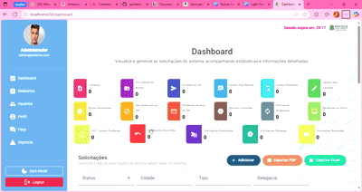

# Sistema de Perícias - Dashboard



## 📄 Descrição

Este projeto é um **Dashboard de Perícias** desenvolvido em **Angular 20+** com foco em **gestão de solicitações, métricas e usuários**. A aplicação é modular, responsiva e segue boas práticas de desenvolvimento, incluindo autenticação, autorização, gráficos e exportação de relatórios em PDF/Excel.  

A interface é **intuitiva**, com tratamento de estados (*loading, erro e vazio*), animações suaves e gráficos dinâmicos para facilitar a análise de dados.

---

## 🚀 Funcionalidades Principais

- **Autenticação e Autorização** com JWT.
- **Dashboard interativo** com gráficos estatísticos (Chart.js).
- **Gestão de usuários** e permissões.
- **Exportação de relatórios** em PDF e Excel.
- **Filtros dinâmicos** e paginação em tabelas.
- **Tratamento de erros HTTP** centralizado.
- **Responsividade** para desktop, tablet e mobile.

---

## 📁 Estrutura do Projeto

- **core/** → Serviços centrais, guards, interceptors, componentes compartilhados (Navbar, Sidebar).
- **features/** → Funcionalidades específicas como auth, dashboard, users, faqs, urgencia.
- **assets/** → Imagens, ícones, arquivos estáticos.
- **environments/** → Configurações de ambientes (`dev` e `prod`).

---

## 🛠 Tecnologias Utilizadas

- Angular 20+  
- TypeScript  
- Bootstrap 5  
- Angular Material  
- Chart.js  
- RxJS  
- jsPDF & jsPDF-AutoTable  
- XLSX (Excel export)  

---

## ⚡ Scripts Disponíveis

No diretório raiz do projeto:

```bash
# Iniciar aplicação em modo desenvolvimento
npm start

# Compilar para produção
npm run build

# Compilar e assistir alterações
npm run watch

# Executar testes
npm test

## 📑 Documentação

Para mais detalhes sobre a arquitetura, funcionalidades e uso do sistema, consulte a documentação:  

[📄 Documentação - Giulia.pdf](Documentação%20-%20Giulia.pdf)

---

## 👩 Autora

**Giulia Trevisan**  
Instagram: [@trevisandev](https://www.instagram.com/trevisandev)

---

## 🎯 Considerações

Este projeto é resultado de estudo e desenvolvimento prático em **Angular**, com atenção especial à **UX/UI**, **responsividade** e **boa arquitetura de código**.  

Espero que esta ferramenta contribua para a **gestão eficiente de perícias**, oferecendo uma experiência **simples, rápida e confiável** para os usuários.
